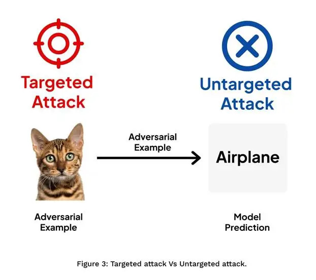

# Formulating Attacks

An adversarial attack is an attempt to perturb the data point $x \in \mathbb{R}^d$ to another point $x' \in \mathbb{R}^d$. For instance, if $x$ is the feature vector of a panda, we want $x'$ to be the feature vector, with the same dimension, but that of a gibbon. 

If we specifically want the attack such that the detection is gibbon, this is called a **targeted attack** as now we have a target we aim at. However, if all we want is just misclassify, I don';t care whether the panda is detected as a gibbon or a dog, all I want is it should be detected wrong. This kind of attack is **untargeted**.

## Additive Attacks

Let $x_0 \in \mathbb{R}^d$ be a data point belonging to class $C_i$. Define a target class $C_t$. An adversarial attack is a mapping $A: \mathbb{R}^d \to \mathbb{R}^d$ such that the perturbed data $x = A(x_0)$ is misclassified as $C_t$.

You might be wondering what the function $A$ is. This comes in various forms. But the most straightforward mapping is:

$$x = x_0 + r$$

commonly known as **additive perturbation**.

For instance, if you have an image of a cat represented by a feature vector $x_0$ and you want to fool the machine to make it look like a dog. You carefully decide the perturbation vector $r$. Now the new vector is $x = x_0 + r$ with some $r$ noise. And the machine, which initially detected $x_0$ as cat, now after the noise, detects $x$ as a dog. Notice that the $x_0$ and $x$ look the same to humans, but the model thinks they are completely different.

### Why Additive Perturbations Work

Additive attacks guarantee that the input space remains unchanged. For example, if I had the image of a cat as $[x_1, x_2, x_3, x_4]$ feature vector, the noise would be $[r_1, r_2, r_3, r_4]$ and adding these two vectors ensure that they are in the same dimension space:

$$x = \begin{bmatrix} x_1 \\ x_2 \\ x_3 \\ x_4 \end{bmatrix} + \begin{bmatrix} r_1 \\ r_2 \\ r_3 \\ r_4 \end{bmatrix} = \begin{bmatrix} x_1 + r_1 \\ x_2 + r_2 \\ x_3 + r_3 \\ x_4 + r_4 \end{bmatrix}$$

*Placeholder: Create a vector diagram showing x₀, r, and x = x₀ + r*

<video width="100%" controls>
  <source src="additive_attack_demo.mp4" type="video/mp4">
</video>
*Placeholder: Manim animation showing the addition of noise vector to original vector*

## Minimum Norm Attack

I mentioned above that the perturbed data point is very small and there is a slight difference between the original vector $x_0$ and the new vector $x$. How do we decide what's the perturbation? How do we ensure it's as small as possible while still misclassifying the initial cat? This can be formulated as an interesting optimization problem.

### The Optimization Problem

The minimum norm attack finds a perturbed data $x$ by solving the optimization:

$$\begin{aligned}
\min_{x} \quad & \|x - x_0\| \\
\text{subject to} \quad & \max_{j \neq t} \{g_j(x)\} - g_t(x) \leq 0
\end{aligned}$$

where $\|\cdot\|$ can be any norm specified by the user (commonly $L_2$ or $L_\infty$ norm), and $g_j(x)$ represents the model's confidence score for class $j$.

### Breaking Down the Constraint

The constraint $\max_{j \neq t} \{g_j(x)\} - g_t(x) \leq 0$ ensures that:
- $g_t(x)$ (confidence for target class $C_t$) is greater than all other class confidences
- This forces the model to classify $x$ as the target class $C_t$

*Placeholder: Create a diagram showing the feasible region and optimal perturbation*

### Why This Matters

As shown in the definition, the goal of the minimum norm attack is to minimize the perturbation magnitude while ensuring the new data $x$ is classified as $C_t$. This is a classic attack as it ensures the initial image of cat and the image after noise look the same to human eyes since the noise is very small, while still causing the machine to misclassify.

**Key insight:** We're finding the **smallest possible change** that crosses the decision boundary of the classifier.

<video width="100%" controls>
  <source src="minimum_norm_demo.mp4" type="video/mp4">
</video>
*Placeholder: Manim animation showing decision boundary and minimum perturbation*

### Generalization Beyond Classification

Remember the above example given is for classification problem, but it generalizes well to different kinds of networks where the goal is to minimize the difference between feature vectors of old $x$ and new $x$ after the noise. Whether you're attacking:
- Image classifiers
- Object detectors
- Segmentation networks
- Even generative models

The core principle remains: **find the smallest perturbation that achieves your adversarial goal**.

---

*In the next section, we'll dive into specific attack algorithms like FGSM (Fast Gradient Sign Method) and see how these theoretical concepts translate into practical attacks.*